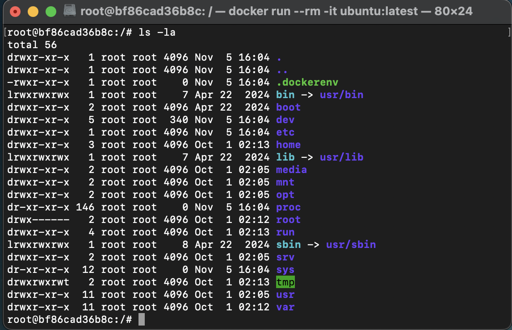
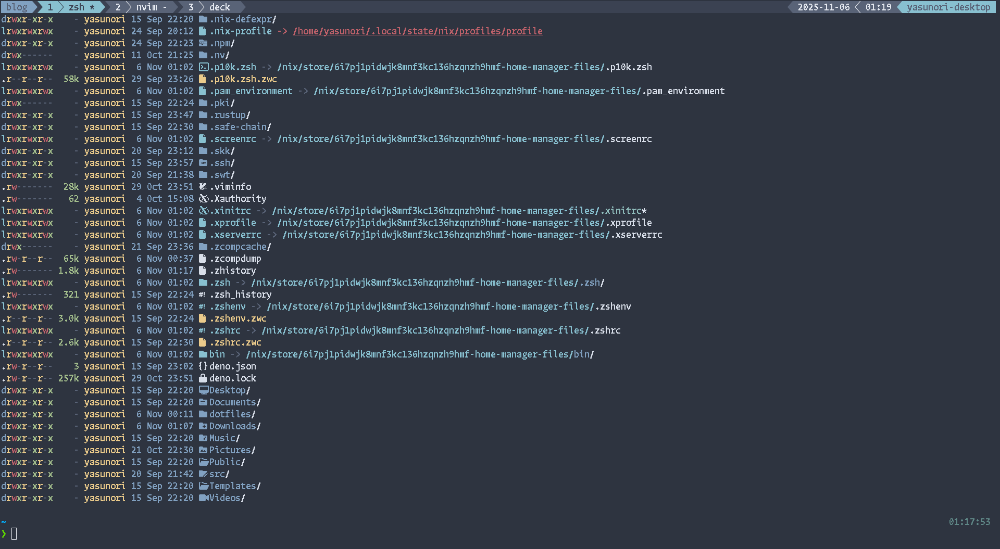
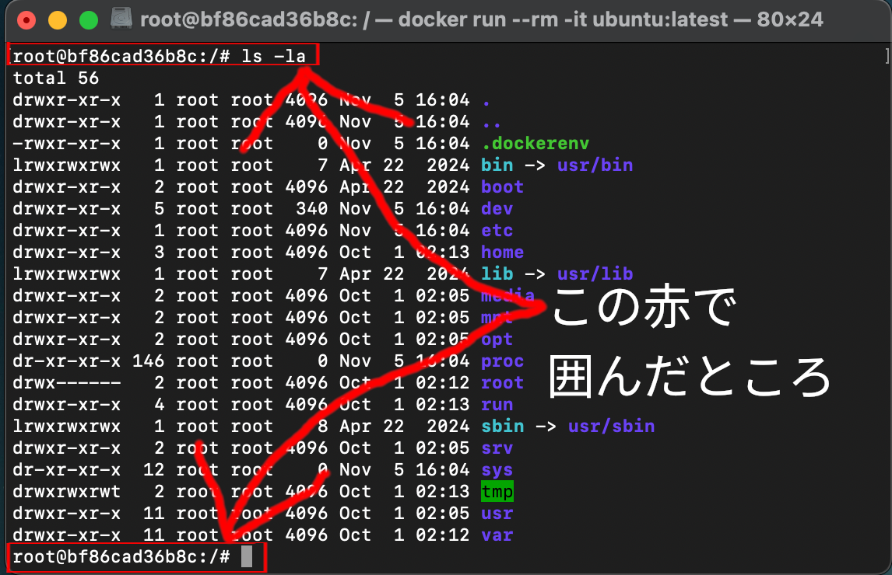
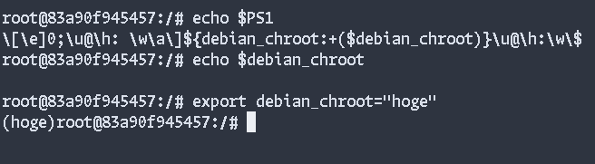
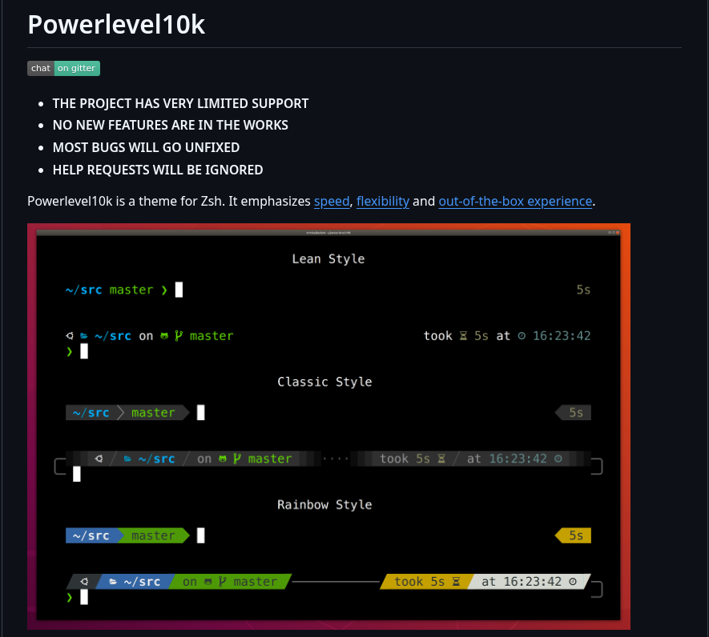
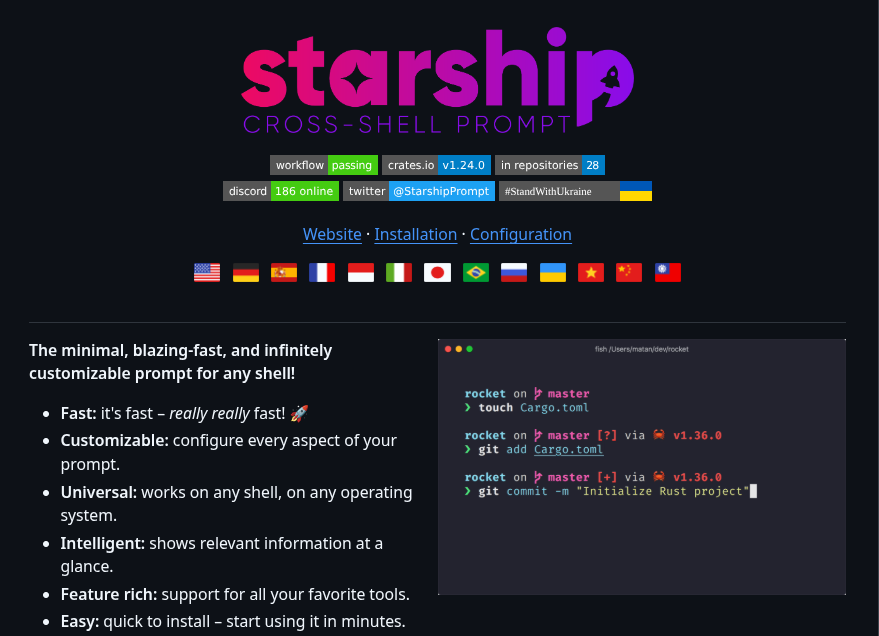

<!-- textlint-disable -->

<!-- {"layout": "title", "freeze": true} -->

# 絶対に設定しておきたいshell環境

## ゆるくshellを使いやすくしよう

---

<!-- {"layout": "title_center", "freeze": true} -->

## ところで皆さん、<br>黒い画面は好きですか？

---

<!-- {"layout": "title_center", "freeze": true} -->

## 私は大好きです！

---

<!-- {"layout": "title_only", "freeze": true} -->

## こんなやつ？



---

<!-- {"layout": "title_center", "freeze": true} -->

## なんか…<br>          ダサくない…？

---

<!-- {"layout": "title_center", "freeze": true} -->

## 私が好きなのは…

---

<!-- {"layout": "space", "freeze": true} -->



---

<!-- {"layout": "title_center", "freeze": true} -->

## これこれ！<br><br>こういうの！

---

<!-- {"layout": "title_center", "freeze": true} -->

## でも、実際のところ、<br>こうやってカスタマイズしている人少ないよね…？

---

<!-- {"layout": "title_center", "freeze": true} -->

## サーバー上は無理でも、<br>ローカルのshell環境は<br>カッコよくしよう！！

---

<!-- {"layout": "title_center", "freeze": true} -->

## これが、<br>今回の勉強会のモチベーション

---

<!-- {"layout": "title_only", "freeze": true} -->

## 自己紹介

```yaml
name: yasunori
likes: 
  - Linux
  - Vim/Neovim
  - dotfiles
links:
  - https://github.com/yasunori0418
  - https://blog.yasunori0418.dev
  - https://x.com/YKirin0418
memo: |
  Always, everyday, everyone, a memorial year of linux desktop!!
  And my dotfiles 5500commit over!!
```


---

<!-- {"layout": "key_point", "freeze": true} -->

## それでは、本題へ…

---

<!-- {"layout": "section", "freeze": true} -->

## 今回の勉強会における<br>                       shellの設定について

---

<!-- {"layout": "2column_content_and_title", "freeze": true} -->

## 勉強会の目的

### やること・ゴール

1. 今回の勉強会で扱う対象はzshとします。
2. 皆さんのshellの設定を尊重します。
3. 「shellの設定をしてみたい！」になれること。

### やらないこと・注意点

1. 具体的な設定方法の解説はしません。
2. 私の設定例や利用例を紹介することはありますが、これが全てではありません。
3. zshしか扱いませんが、<br>他のbashやfish/nushellといった物にも<br>応用できるかもしれません。

---

<!-- {"layout": "title_center", "freeze": true} -->

## つまり……<br><br>shellを設定していく上での<br>道標を示すだけです。

---

<!-- {"layout": "section", "freeze": true} -->

## shellを彩るプロンプト

### AIのそれじゃないよ！

---

<!-- {"layout": "title_center", "freeze": true} -->

## Question.<br>  shellのプロンプトってどうやって<br>  定義されているんだろう

---

<!-- {"layout": "space", "freeze": true} -->



---

<!-- {"layout": "title_center", "freeze": true} -->

## Answer.<br>`echo $PS1`

---

<!-- {"layout": "title_center", "freeze": true} -->

## ちなみに`ubuntu:latest`の<br>`docker image`だと、<br>こんな設定になっている



---

<!-- {"layout": "content_only", "freeze": true} -->

- **エスケープシーケンス部分:**
  - `\[\e]0;\u@\h: \w\a\]`
  - ターミナルのタイトルバーを設定するエスケープシーケンスです。
- **chroot環境の表示:**
  - `${debian_chroot:+($debian_chroot)}`
  - debian_chroot変数が設定されている場合、その値を括弧で囲んで表示します。
- **ユーザー名:**
  - `\u`
  - 現在のユーザー名を表示します(例: root)。
- **区切り文字:**
  - `@`
  - ユーザー名とホスト名の間の区切り文字です。

---

<!-- {"layout": "content_only", "freeze": true} -->

- **ホスト名:**
  - `\h`
  - ホスト名の最初の部分を表示します(例: コンテナID)。
- **カレントディレクトリ:**
  - `:\w`
  - コロンの後に現在の作業ディレクトリのフルパスを表示します。ホームディレクトリは`~`で省略されます。
- **プロンプト記号:**
  - `\$`
  - 一般ユーザーなら`$`、rootユーザーなら`#`を表示します。

---

<!-- {"layout": "title_center", "freeze": true} -->

## うわっ……<br>この複雑奇怪な文字列を組み合わせないと設定できないのか…

---

<!-- {"layout": "title_center", "freeze": true} -->

## カッコよくて<br>良い感じにしたい！！<br><br>だけど、めんどそう……

---

<!-- {"layout": "title_center", "freeze": true} -->

## そうだ、プラグインを使おう

---

<!-- {"layout": "2column_content_and_title", "freeze": true} -->

## プロンプト設定用プラグイン紹介

### romkatv/powerlevel10k



### starship



---

<!-- {"layout": "content_and_title", "freeze": true} -->

## プロンプトに表示して欲しい内容

- 現在のディレクトリ
  - 階層が深いなら短いパスになってくれると更に良い(通称pathshorten)
- リポジトリ内におけるGitの各種情報
  - 現代のshell生活なら必須、そう思ってました…
  - 以外と設定していない人がいて、今回の勉強会があるってわけ
- 直前のコマンド実行時の`exit code`
  - コマンド実行後に`echo $?`で確認できる終了コード
  - `exit 0`で終了しているのを確認できると、とても安心できます
- ホスト名(任意)
  - ローカルのshell環境に限定するなら、ぶっちゃけ必要はない

---

<!-- {"layout": "title_center", "freeze": true} -->

## 今回紹介したプラグインを使えば<br>必要な物は確実に表示されます！！

---

<!-- {"layout": "section", "freeze": true} -->

## 標準的なコマンドを置き換えよう！

### 拡張版のコマンド達を紹介

---

<!-- {"layout": "content_and_title", "freeze": true} -->

## よく使う標準コマンド

- `cd` → ディレクトリ移動
- `ls` → ディレクトリ内のファイル・ディレクトリ一覧表示
- `find` → ファイル・ディレクトリ検索
- `grep` → ファイルから正規表現にマッチする行を検索し表示
- `cat` → ファイル結合…なんだけど、ファイル表示に使われがち

---

<!-- {"layout": "title_center", "freeze": true} -->

## これらのコマンドでも日常の<br>作業は特に困りません

---

<!-- {"layout": "title_center", "freeze": true} -->

## ですが、折角のローカル環境なので<br>もっとオシャレにしませんか？

---

<!-- {"layout": "content_and_title", "freeze": true} -->

## 置き換え先のコマンド達

- `cd` → `zoxide`
- `ls` → `eza`
- `find` → `fd`
- `grep` → `ripgrep`
- `cat` → `bat`

---

<!-- {"layout": "content_and_title", "freeze": true} -->

## `zoxide`

- `cd`コマンドを置き換え、訪問済みディレクトリを記憶
- 頻繁にアクセスするディレクトリへの素早い移動が可能
- `z <ディレクトリ名>`で曖昧検索によるディレクトリ移動

---

<!-- {"layout": "content_and_title", "freeze": true} -->

## `eza`

- `ls`コマンドを置き換え、色分けされた見やすいファイル一覧表示
- ファイルタイプに応じたアイコン対応で視認性向上
- ツリー表示やGit統合など、豊富な表示オプション

---

<!-- {"layout": "content_and_title", "freeze": true} -->

## `fd`

- `find`コマンドを置き換え、シンプルで直感的なシンタックス
- 標準的なfindよりも高速なファイル検索
- 正規表現対応で複雑な検索パターンにも対応

---

<!-- {"layout": "content_and_title", "freeze": true} -->

## `ripgrep`

- `grep`コマンドを置き換え、高速で効率的な正規表現検索
- 複数ファイルの検索にも対応し、Rustで実装された高速処理
- .gitignoreに対応し、不要なファイルを自動的にスキップ

---

<!-- {"layout": "content_and_title", "freeze": true} -->

## `bat`

- `cat`コマンドを置き換え、シンタックスハイライト機能付き
- 行番号やGit差分の表示に対応
- テーマカスタマイズ可能で、見栄えの良いファイル表示

---

<!-- {"layout": "title_center", "freeze": true} -->

## これらのオシャレコマンド達は<br>日々どこかで開発されているので<br>いろいろ探してみましょう！

---

<!-- {"layout": "section", "freeze": true} -->

## aliasだけじゃない！<br>これがプラグインやコマンドの<br>組み合わせだ！

### スニペット展開やあいまい検索できるようになるzeno.zshとfzfの紹介

---

<!-- {"layout": "section", "freeze": false} -->

## 設定を維持していくためのdotfiles

### いっぱい育て行こう！

---

<!-- {"layout": "section", "freeze": false} -->

## まとめ

---

<!-- {"layout": "section", "freeze": false} -->

## 勉強会にご参加<br>ありがとうございました！
