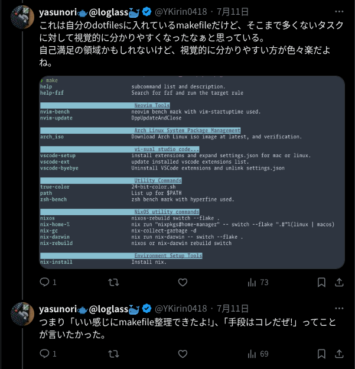

## 始めに

最近、会社のテックブログで「[職場のプロジェクトに必ず配置しちゃうMakefileの話][my-makefile-blog]」というタイトルで記事を公開しました。
ありがいことに執筆時点で100を越える高評価をいただきました。
Twitter(X)やvim-jp内からも良かったという反応をいただけて、とてもうれしくなりました。
最近公開する技術記事は個人ブログで公開していたこともあり、広範囲からの反応が見えることのおもしろさをあらためて実感しました。

その後、たけてぃの個人ブログにて「[Makefileを便利コマンドメモとして使うことに対する違和感][takeokunn-blog]」というタイトルの記事が公開されました。
記事の内容は自分も読んで、納得できる部分もあるし、実際に気を付けなきゃいけない要素はたくさんあるという事を気付かせてくれる良い記事です。

[][takeokunn-blog]

この記事が公開されたタイミングでvim-jpの`#tech-cli`チャンネルで議論が繰り広げられ、これをコミュニティに閉じておくのも良くないと思い、
補足を付けつつ[Twitter(X)で投稿をしました。][my-post]

[][my-post]

そこで、今回はこの補足投稿を記事の形にして、清書しておこうと思います。
なんと言ってもTwitter(X)の投稿というのは流動的な物ですので、ちゃんと書き残しておきます。

あらためて明言しますが、この記事や[補足の投稿][my-post]における意見は、たけてぃの記事を否定・批判する物ではありません。
たけてぃの記事も良い物ですので、ちゃんと読んでから、こちらを読んでください。

これも明言しますが、これは**あくまでも個人の意見**です。

## Zennで公開していたサンプルのMakefileについて

今回の記事において、サンプルとして提示したMakefileは**実運用している物ではありません。**\
**コマンドの一部技術スタックは会社の物に近くしていますが、同じコマンドは1つもありません。**

あの記事で伝えたい本質的な物は次の通りです。

- 大量のタスク定義は**認知負荷を生み出す**
- 大量定義されたコマンドもグルーピングしたら分かりやすくなる
- グルーピングし整理できた結果**認知負荷は低くなっている**と言えないだろうか
- 大量のコマンドを整理する手段を紹介したかった
- 結果、見た目は良くなった方が「良いよね」というのを伝えたい

まず、大量定義したコマンドは問題提示の**方法**として利用しています。
私としてもあそこまで宣言されたコマンドは減らした方が良いと思っています。

「それなら最初から、大量のコマンドを作らなきゃ良いじゃないか」

という意見が出るかもしれません。\
それなら逆に、「**最初からプログラムなんか作らなきゃ良いじゃないか**」と言えないでしょうか？

自分が書いた記事の本質として、「大量のタスクをグルーピングして視覚的に分類されたら分かりやすいよね」という物で、大量のタスクを書くことは推奨していないです。\
推奨していないことは暗黙的になっていて、説明不足かもしれないとは思いました。\
大量にコマンドを羅列したのは、あくまでも認知付加が高くなる最悪のケースです。\
それを回避する手段として今回の記事の手段も使えます。



## 「本来はREADMEを充実させるべき」の`@echo`について

これはたけてぃもvim-jp内の会話で認識済みの話ではありますが、
記事内で`@echo`を使ったのはあくまでサンプル的に実行できることを目的にしていました。\
実際に運用しているMakefileではコマンドの実行をさせてます。

<!-- textlint-disable -->

> サンプルのMakefileをコピペで試してもらいやすいように、全てechoコマンドにしておきました。

<!-- textlint-enable -->

記事内においても、上記の補足を入れています。

## マシン環境に依存するコマンド

Zennにて記事公開の初版において、行儀の良くない「マシン環境に依存するコマンド」が例として含まれていました。\
以下は、たけてぃの記事内で紹介のあったコマンドです。

<!-- markdownlint-disable MD010 -->
```make
install-tools: ## 開発ツールのインストール
	brew install postgresql redis minio awscli
	npm install -g @aws-amplify/cli
```
<!-- markdownlint-enable -->

最初に補足した通り、この記事では大量のコマンドを整理する手段を紹介している物です。\
とはいえ、こういったコマンドが含まれているのは良くないので、公開後に[削除する対応][delete-but-command]をしました。

私もそういうコマンドは推奨していなく、誤解を招いてしまったことをあらためてお詫び申し上げます。

こういった外部で使うべきコマンドはmise/aqua/nixで解決できそうだなと思ってます。\
個人的にはnixにすることで解決したいと思っています。

そもそも、nixのインストールを標準化できれば、Makefileは不要になります。

## Makefileの利用想定者

これに関しては、[たけてぃの記事内][takeokunn-blog]で明言されているとおりです。\
そのうえで補足が必要だと思ったことについて書いていきます。

<!-- textlint-disable -->
### 『「そのプロジェクトに精通しているプログラマ」はそもそもMakefileを使わない』に対する回答
<!-- textlint-enable -->

ここで明言されている通りだと思います。\
プロジェクトに精通していて、細かい事情をすべて把握しているエンジニアだけで構成されている開発チームなのであれば、Makefileによる補助輪は不要です。\
Makefileで抽象化すること自体が手間であり、お節介で勝手にshellにaliasを追加しているような物です。

とはいえ、精通している人だけが開発しているわけではないので、誰にでも優しくあるべきだと思ってます。
最初は誰も精通していないので、精通している人こそが、あとから来る誰かに優しくしなきゃいけない。

実際、自分は会社に入ったばっかりだし、環境構築で困った問題は、どこかで誰かが詰まる可能性がある問題だと思っています。
当然、環境構築手順も直すし、Makefileで自動化できたらミスが減らせます。

## 『AI Coding Agentフレンドリーじゃない』に対する回答

たしかにMakefile自体はAIに優しくないと思われます。\
ただ、helpコマンドによる整形で、`コマンド対ドキュメント`の関係性が作れています。\
これはAIが読んでくれたらうまく使ってくれないかな？と思ってます。

これは試せてないので、研究の余地ありだと思ってます。\
あとMakefileを作った当初(たぶん2023年ごろ)は、こんなにAIに全任せの時代じゃありませんでした。\
AIフレンドリーと言うよりも、ヒューマンフレンドリーにしている歴史的背景はあります。

もちろんREADMEを拡充するほうがAIに優しくなります。

## 『正規表現はメンテナンス性が低い』に対する回答

コレばっかりはぐうの音も出ないですね…。
ある意味、今回の正規表現の内訳を解説するのも裏目的としてあります。

ただ、今回の正規表現において、メンテナンス性はそこまで悪いものではないと思っていて、ちょっと調べれば出てくるレベルの物と認識してます。

`/(肯|否)定(先|後)読み/`

とか読みたくないよね？
さすがにそんな複雑奇怪な正規表現ではない…はず…。

## Makefileを選択する意図とほかのタスクランナーに対する意見

Makefileをタスクランナーとして使うという手段においては、「`Just`や`Task`などのタスクランナーをインストールしとけば良いじゃない」という意見も分かります。\
ただ、`gnu/make`ならmacOSやLinux環境であれば初期からインストールされている確立が高いです。\
開発環境構築の最初のステップとして、準備の手間が省けるMakefileに白羽の矢が立ちました。

あなたはプロジェクト単位で使わなきゃいけないツールの追加は、**ランタイム以外は避けたい**と考えているとします。
「さぁ、これから開発環境を構築しましょう！」と言われて、何かのタスクランナーをインストールすることが強制されたとします。\
この時点で前提としての「ランタイム以外は避けたい」という条件は崩壊します。

誰にでも優しくあろうと思った末の戦略としてのMakefileだったのです。

タスクランナーとして開発されたツールはたくさんあるし、たけてぃが言うようにnpmの`package.json`を使うのも全然ありです。\
そういったエコシステムが整っている言語を使っている分には、Makefileという手段を取らないと思います。

あと個人的にはタスクランナーとして開発されたツールのデファクト的なものがないと思っていて、かつ人によって好みが別れると思っています。\
誰もがshellやterminalを使いたい訳じゃないし、ましてや「タスクランナーを好んでインストールするパターンって少ないのでは？」と考えています。

前提として、terminalを使いたがる人ばかりではありません。
致し方なくterminalを触る人が多数派なのです。

とはいえ環境構築の上では止むを得ずterminalを触るので、追加のツールは少ない方が良いと考えています。\
誰にでも使ってもらう手段としてMakefileがちょうど良いと思っています。

## まとめ

開発のために「このコマンドとあのコマンドを組み合わせて、こんな風な運用で、これで便利になるはず！」というのを考えるのが好きだったり、
無意識に考えてしまうのが、自分の思う**環境構築オタク**です。

今回はMakefileに対する新な視点を得られました。

そして、このMakefileが完璧と言っている訳ではなく、さらに良い手段を探求したいと思うようになりました。

<!-- links -->

[my-makefile-blog]: https://zenn.dev/loglass/articles/0016-make-makefile
[takeokunn-blog]: https://www.takeokunn.org/posts/permanent/20250711132607-why_not_command_memo_makefile
[my-post]: https://x.com/YKirin0418/status/1943667758673093035
[delete-but-command]: https://github.com/yasunori0418/blog/commit/9b4b732916d6b425baa8305121374a72c4688c39
