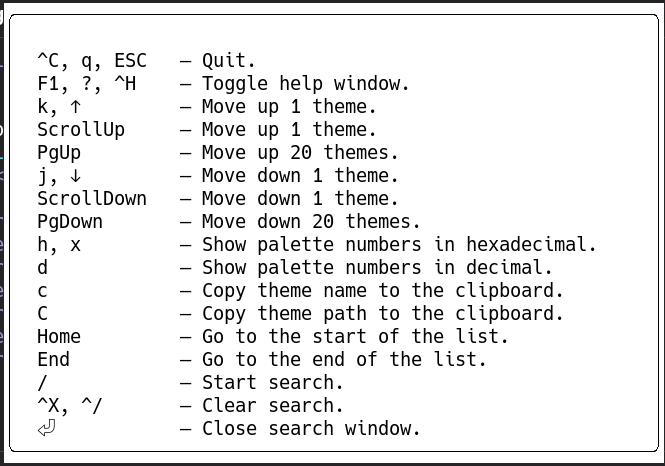

## 始めに

最近出てきたGhosttyというターミナルエミュレーターが盛り上がっていますね。
流行に乗って私もGhosttyをひととおり設定して現在はメインで使っています。

設定していくときに見ていった点を紹介していきます。

## Ghosttyについて

https://ghostty.org/

Ghostty自体は`zero configuration`を謳っていますが、[Configuration > Option Reference](https://ghostty.org/docs/config/reference)のページを見てみるとかなりの数設定項目があります。\
ここからキーバインドも含めると大変な量になっていきます。\
ですが、基本的にはいい感じのデフォルト値が設定されているので、設定を凝りたい人は設定できるというスタンスみたいです。

私は「設定させていただきありがとうございます」勢なので、まずはひととおりの設定項目とデフォルト値を確認したい訳です。\
そんな人のためにGhosttyは次のコマンドを用意してくれています。

```shell
ghostty +show-config --default --docs
```

これで各設定項目のドキュメント付きのデフォルト設定を出力できます。
この設定を`$XDG_CONFIG_HOME/ghostty/config`に配置したら、デフォルト値や説明を確認しつつ設定を変更しやすくなります。

### 設定していくのに便利なTips達

基本的にはドキュメントに丁寧な説明が付いているので、頑張って読んでください。\
…とはなりますが、その中でも特筆しておいた方がよさそうな物を紹介しておきます。

#### `config-file`の魅力的な部分

`config-file`は分割した設定ファイルを読み込むということができます。\
設定が大好きな人にとっては狂うほど設定を分割してしまうかもしれません。\
私もその一人です。

そんな設定ファイルですが、環境によっては読み込んで欲くないというパターンもあるかもしれません。\
ある環境にはファイルが存在しないという状況があるとき、「対象の設定ファイルが存在しないときはエラーにならず無視してくれる」という記法がGhosttyでは用意されています。\
私はnixのhome-managerで環境によって配置するファイルを切り替える対応をしています。

https://ghostty.org/docs/config#splitting-into-multiple-files

```ini
# これは必ず読み込まれる
config-file = path/to/hoge.conf

# 存在しなかったら読み込まれないし、エラーにもならない
config-file = ?path/to/optional.conf
```

これにより、ベースとなる設定ファイルを環境毎に編集する手間を省くことが可能になります。

また、後に同じキーで設定を宣言した場合、それよりも前に宣言した設定を上書きするという仕様になっています。\
この機能を活かして、環境毎の設定をいい感じに切り替えができます。

#### themeはconfig-fileと同じように後の設定で上書きされる

私のようにデフォルト設定をリダイレクトを使って設定ファイルを生成した状態から、各種設定をしていくとテーマの適用が思うようにされません。\
これには理由がありまして、`theme`の宣言の後にデフォルトの色設定が宣言されている関係で、`theme`で宣言したカラー設定が上書きされてしまいます。

これは実際に私が詰った現象のため、私のようにデフォルト設定から設定していく人達に向けてのメッセージにもなります。

`theme`の種類に関しては、次のコマンドにてプレビューしながら確認できます。\
一応、プレビュー内の操作ヘルプの画像も残しておきます。

```shell
ghostty +list-themes
```




プレビュー内でthemeの実体パスを確認できるのでnixを使っている私としては、`/nix/store`をgrepしなくて助かりました。

themeファイル内で定義されている設定を`theme`宣言後の設定で宣言しないように気を付ければ問題はありません。

```txt
palette = 0=#RRGGBB
...
palette = 15=#RRGGBB

background
foreground
cursor-color
selection-background
selection-foreground
```

#### `keybind = clear`でデフォルトキーバインドを削除できる

ターミナルエミュレータのキーバインドは、TUIで生活するコマンド操作大好き人間にとっては死活問題です。\
私のターミナル内操作の基本はtmuxやvimのため、これらを邪魔して欲しくありません。

そんな同志の方々は、`keybind = clear`を設定するといいでしょう。\
デフォルトのキーバインドを削除して、必要なキーバインドだけを設定させていただけます。

```ini
keybind = clear

keybind = ctrl+shift+comma=reload_config
keybind = ctrl+shift+i=inspector:toggle

keybind = ctrl+shift+v=paste_from_clipboard
keybind = shift+insert=paste_from_selection
keybind = ctrl+shift+c=copy_to_clipboard

keybind = ctrl+equal=increase_font_size:1
keybind = ctrl+minus=decrease_font_size:1
keybind = ctrl+zero=reset_font_size
```

どうでしょう、私はこれくらいしかキーバインドを残していません。

## 私の設定

[yasunori0418/dotfiles/home/.config/ghostty](https://github.com/yasunori0418/dotfiles/tree/94f7c49/home/.config/ghostty)

いろいろと紹介したい設定はありますが、設定のドキュメントを読むというのもいい物です。\
参考に私の設定へのリンクを残しておきます。

## まとめ

最初は`zero configuration`で特に設定しなくてもリッチな機能が使えると聞いていましたが、\
設定してみるとalacrittyのようにシンプルな状態にできたり、描画に関してもtruecolorに対応していて素敵なTUI生活をお助けしてくれるいいターミナルエミュレータに出会えました。

皆さんも是非、`zero configuration`といわず設定してみてください。
