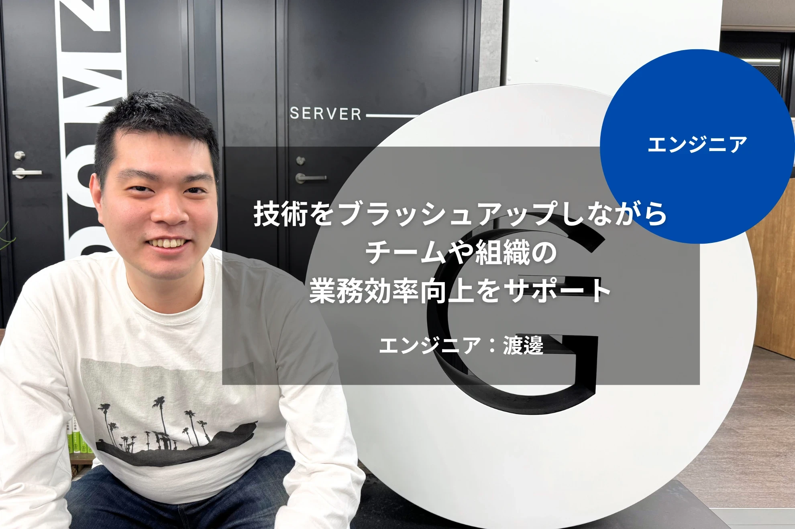

## 始めに

タイトルでは卒業と称していますが、要するに退職です。\
yasunori0418（通称yasunori）こと、渡邊泰紀（わたなべたいき）は2025年3月末をもって、株式会社Gizumo（以下、Gizumo）を退職しました。

退職というタイトル自体が雰囲気としてマイナスなイメージがあるので、プラスに見えるように「卒業」としてみました。

## Gizumoについて

Gizumo入社前は警備員（自宅警備員じゃないよ！）をしていて、自分の子供の頃からの夢であったITエンジニアになるための会社探していました。\
独学で未経験且つ、個人の力だけでITエンジニアに転職するというのは、現在でも非常に難易度が高いです。

その中でもGizumoは入社後のチーム開発の研修があるなど、未経験の者にとっては貴重な環境でした。\
開発ができて、ちゃんとエンジニアとしてのキャリアをスタートできるGizumoという会社に出会えて良かったと思っています。

### どんなことをしてきたのか

「社内でどんなことをしてきたのか」については次のページをご覧ください。

[][gizumo-article]

ざっくりまとめると、次のような感じになると思います。

- SESのエンジニアとしてお客様先で業務、そのままリーダー的活動
- 受託開発や自社開発プロジェクトに参画
- 社内の勉強会開催
- 社内でVimの人として認知される？

## 転職活動について

実のことをいうと、転職活動自体はそこそこ長い期間[^1]やっていました。\
一時期はtomoyaさん、natsukiumさん、たけてぃ、conao3その他大勢の方の協力を頂きながら転職活動をしていました。\
普段入り浸っているvim-jp内では私の転職活動自体は公の事実として認知されていたり、[たけてぃの2024年まとめ][takeokunn-blog]でも私の転職活動自体は垣間見えます。

`yasunori project`として沢山の方々からの応援を頂きましたが、\
活動初期は社内開発部への移動が決っていたこともあり、応援や協力してもらっている方々に申し分けないと思いながらも、転職活動自体は本気で取り組めていませんでした。

本格的な転職活動自体の開始は今年に入ってから最終的に自分の意思で転職をしました。

### 具体的な転職活動の内容

去年末の段階で転職のためのカジュアル面談はいくつか受けましたが、どの企業も年末は忙しかったり、私が担当する業務も忙しかったので年明けから少し時間を置き、転職活動を再開しました。

`yasunori project`の反省点として、試行回数が足りないという意見があったり、面接慣れしていないことが欠点でした。\
これを克服するため、企業研究や相談を兼ねて転職エージェントから紹介してもらったり、\
LAPRASで興味あり入れてくださった企業様とカジュアル面談から面接というのが、今回の転職活動の主軸でした。

その他にもYOUTRUSTを活用してみましたが、複数の連絡手段を使っての転職活動は連絡コントロールが難しいと判断し、
転職エージェント経由とLAPRAS経由、いくつかの直接応募とリファラルが転職活動中にやりとりしていた範囲になります。

連絡先が多すぎると、そのやりとりが重なり混乱してきたので、媒体や応募数は制御した方がいいと感じました。\
いくつかの企業様にはお返事が遅くなってしまったこともあるので、仕事をしながらの転職活動はバランスが大事です。

### マインド面

転職するにあたって次のことを重要視しながら活動しました。

- 自分ができることは何か
- 自分がチャレンジしたいことは何か
- 転職先で自分が出せる価値は何か
- 自分が転職した先で何がしたいのか
- 上記のこれらは、ナゼ現職ではできないのか

転職活動における本音や目的は、キャリアアップだったり環境の変化、その先のスキルアップが主になります。\
とはいえ転職活動の相手となる企業は個人のキャリアとかスキルアップよりも、採用に進んでいる人が会社で働いて価値を出せる人なのかが見たいところのはずです。\
キャリアアップやスキルアップといった物は、採用後の成果でしかありません。\
もっと言ってしまえば、キャリアが上がったりスキルが上がるのは個人の活動次第です。

要は「それができるだけの人間であるか」を見せることができるか、そう思いながら面接しようと思いました。

## 今後目指していくこと

その上で前述したリストを埋めると、次のようになりました。

- 自分ができることは何か
  - プロダクトの改善に関する活動量
  - まだ足りない部分はあるかもしれないが、TDD的に開発を進めることができる
- 自分がチャレンジしたいことは何か
  - 関わるプロダクトの「グロース・安定性・信頼性・パフォーマンス向上」に寄与したい
  - 前項の活動結果として、プロダクトを使う人が喜んで欲しい
- 転職先で自分が出せる価値は何か
  - 僅かではあるが、チームを技術で引っ張った経験
  - UnitTestの導入や、障害対応時の運用フロー作成といった信頼性を向上するための活動経験
- 自分が転職した先で何がしたいのか
  - 物作りとして本質的に、***いい物を作っていきたい***
    - 誇れるだけの高い品質の物を作りたい
- 上記のこれらは、ナゼ現職ではできないのか
  - 会社の規模や事業状況的に挑戦しずらい

究極的に言ってしまえば、ITエンジニアとして経験年数2～3年の私が出せるのは、勢いと熱量を出すしかありません。\
仮に社内で技術力が高いと評価されたとしても、社会と業界の広さで比較したら、 **まだまだ弱い** のです。

`yasunori project`の一環としてTDDについて学ぶことができたので、これを今後の武器にしていきたいという強い思いがありました。\
実際、直近の業務ではTDD的開発を主導する側になっていることもあり、テストの重要性を大事にしたいと考えています。

## 最後に

結果として無事転職できたのと同時に、Gizumoとの別れになりました。\
ですが、ここでの出会いや経験というのは今後も生きてくると思っています。

また転職先の会社についてのエントリに関しては後日公開予定です。

<!-- textlint-disable -->
**ありがとう、Gizumo!!**

**もっとエンジニアとしてデカくなってきまぁす！！**
<!-- textlint-enable -->

<!-- link list -->

[gizumo-article]: https://www.wantedly.com/companies/gizumo-inc/post_articles/954250
[takeokunn-blog]: https://www.takeokunn.org/posts/permanent/20241221130328-retrospective_2024/#:~:text=yasunori%20project%E3%81%A8%E7%A7%B0%E3%81%97%E3%81%A6yasunori%E3%81%AE%E8%BB%A2%E8%81%B7%E6%B4%BB%E5%8B%95%E3%82%92%E5%85%A8%E5%8A%9B%E3%82%B5%E3%83%9D%E3%83%BC%E3%83%88%E3%81%97%E3%81%BE%E3%81%97%E3%81%9F%E3%80%82
[^1]: 2024年6月頃から
