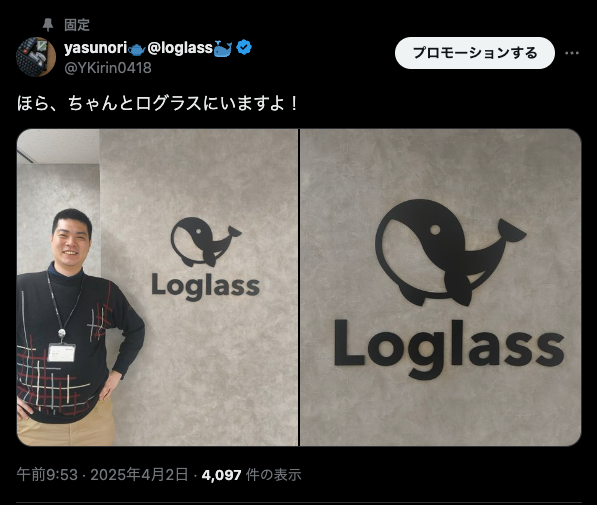
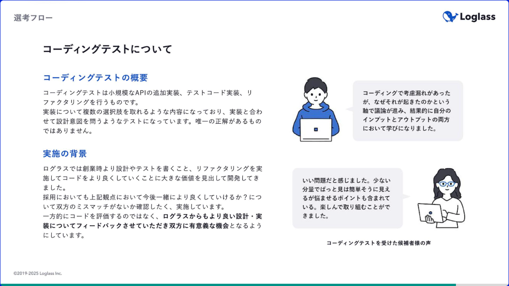

## 始めに

<!-- textlint-disable -->

2025年4月に株式会社ログラスにJoinしました。

前職については[こちら](../first-it-company-graduation)をご覧ください。

## ログラスとの出会い

去年末、業務でテストコードを書きまくっていたこともあり、テストの粒度をどうしていくべきなのか迷っていました。\
そんな中で、Zennで公開された「[オニオンアーキテクチャにおけるテストコーディングガイド][村本さんの記事]」という記事と出会いました。\
テストに対する理解度が深まる良い記事です。

最後まで読んだ後、ログラスの採用情報を見てすてきな会社だと思い、記事内にあったpittaからカジュアル面談の連絡をしました。

## なぜログラスを選んだのか？

関わるプロダクトは品質を良い状態にしたいと思うものです。\
そのためのテストコードだったり、環境整備というのは大事だと常に思っています。\
当然ながら継続的にリファクタリングはしていきたいものです。

現実問題として、そう簡単ではありません。\
事業の状態や開発の進捗状況に応じて、そういった品質というのはないがしろになってしまうものです。\
新機能をリリースしていかないと売り上げにつながらないし、顧客の問題は早く解決できるに越したことはありません。\
そのために品質を下げてリリースすることで、後に技術負債となりさらなる事業成長が遅くなってしまいます。

本質的に解決したいのは事業ドメインのはずが、事業成長のために生み出してしまった技術負債を返済することになったり、 さらなる技術負債が生まれるという負のスパイラルに陥っている状態ですね。\
この事業成長と技術負債というジレンマがない、もしくは仕組みとして解決しようとしている会社に行きたいと強く思っていました。

究極的には品質を良くし続けることに注力して、利用する顧客が満足するものを作りたいのです。\
「そんなジレンマを乗り越える判断ができる会社、本当にあるのか……？」と思っていました。

*ですが、そんな会社があるんです。*

**それが株式会社ログラス！！**

採用情報のスライド内でコーディング試験について触れられている部分や、 [エンジニアの採用ページ内][webアプリケーションエンジニア採用ページ]でもリファクタリングやテストコード、品質の向上について触れられています。

あとは会社全体の雰囲気として、自社のプロダクトに対して熱意を持っているところが良いと感じました。

「良い景気を作ろう。」というミッションは大きな挑戦ではあるものの、 このログラスという会社なら実現できるかもしれないと思わせるほどの計画性を採用情報のスライドから感じて応募しました。

## ログラスで何をなし得たい・実現したいか？

これまでの職歴としては高卒で警備員から始まり、SESの会社でITエンジニアになり、自社開発のSaaS企業に転職という、自分でも見返してみると波瀾万丈なキャリアだと思っています。\
ITエンジニアになった時点で、子どものころからの夢であったプログラムを書いて仕事をするという目標は達成できています。\
要はそこから先、子どものころでも思い浮かべてなかった次元に入ってきているわけです。

エンジニア……というよりはプログラムを書く者として「[ハッカーになろう][bible]」に書かれている精神的な部分は、自分のマインドや軸としていきたいと思っています。
そのうえで、「**ログラスで何をなし得たいか**」と聞かれたら、技術力で信頼されるような存在になりたいと考えています。

より技術力を鍛え上げるというだけではなく、**ちゃんとビジネスを理解して**、使用するユーザーに還元できるものを作れるようになっていきたいと考えています。\
当然ながらかなり難しい話ですが、ログラスという会社が戦っているドメインはそういう次元のものですので、これができるようにならなければいけないのです。

もっと言いきるなら、「**ビジネス理解を深めて価値があるものを提供していきたい**」って感じですね。

すごく単純な言葉に言い変えるなら「**もっとエンジニアとしてデカくなりたい**」です。

そういうチャレンジと圧倒的成長ができると確信して、ログラスという会社に応募しました。

## 実際に1ヵ月、仕事をしてみての感想

### 研修

入社してすぐに思ったのは、スタートアップの会社でありながら充実した研修があるということです。\
「研修する時間よりも、早くタスクをつかんで業務理解をしていくべき」というイメージがスタートアップにはありましたが、ログラスではしっかり研修があります。\
対処しなくてはいけないドメインが複雑で高難易度だからというのもあると思いますが、入社した人を成長させるということを大事にしているようです。\
純粋にありがたい話ですし、「もっとドメインや業務理解を深めていかねば……」と思いました。

### 情報量

社内では全体的にSlackとNotionを活用しており、「ビジネスサイドとエンジニアとのコミュニケーションでツールが違う」などという、不便さがありません。\
部署間の情報共有も早く、むしろ大量の情報の波に押し流されないよう、必死についていく必要があります。\
社内全体の雰囲気も良く、コミュニケーションが活発に行われているため、知らないことはどんどん聞きに行けるという空気感があります。

### これまでとの比較

またこれまで、SESとしてお客様先の会社に行ったり、社内の受託開発をしていて思っていたこととして、改善活動やプロダクトの修正方針などの決定権がなく交渉をすることがほとんどでした。\
実際、どの現場や案件でも交渉するための材料を集めて、交渉した後の結果を待つ時間がもったいないと感じていました。\
そこは自社のプロダクトだからこそ決定も早く可能とは思っていましたが、ログラスではさらに早く行動に移すことが価値となります。

相談するよりも実践した方が良いというスピード感は、自分も仕事として求めていたところがありました。\
それ以上に、そういった改善活動を積極的に行うことで、感謝されるのが一番うれしく感じているところです。

実際に入社してから開発環境のMakefileの整備や開発用のスクリプトの改善をして、感謝されたのはすごくうれしかったですし、開発チームに貢献できているという実感がありました。\
その後の業務タスクも順調に進めていき、リリースの日程調整なども主体的に動ける環境と実感しています。

1ヵ月ではありますが、2～3ヵ月も会社にいるような密度で作業をしている感じがあり、これこそ求めていた「チャレンジと圧倒的成長」をひしひしと実感しています。

## さいごに

さて、ここまでの内容で私のログラスへの熱い思いは伝わったでしょうか？\
弊社は現在エンジニア採用も積極的に行っているため、興味がある方は下記のリンクから応募をお待ちしています！

[採用情報はこちら][エンジニア採用情報]

[カジュアル面談はこちら][pitta]

<!-- textlint-enable -->

<!-- links -->

[bible]: https://cruel.org/freeware/hacker.html
[pitta]: https://pitta.me/matches/dlarsRnSEDwx
[webアプリケーションエンジニア採用ページ]: https://hrmos.co/pages/loglass/jobs/Eng-AE-002
[村本さんの記事]: https://zenn.dev/loglass/articles/01b786462eacca
[エンジニア採用情報]: https://www.loglass.co.jp/recruit/for-engineers
