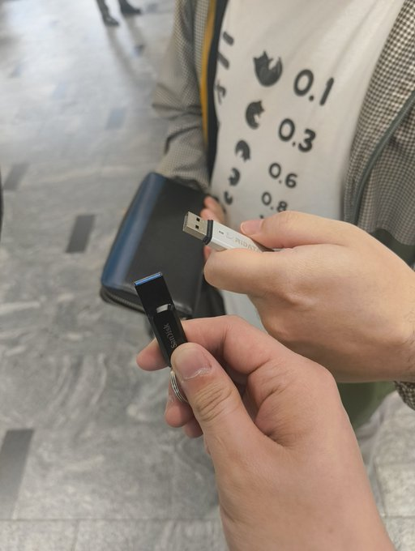

## なぜ、博多へ？

突然決めて動きだした博多旅行。\
訳あって長期の有給を取って、時間を余らせていたので、何かしようと思って博多へ行くことに決めた。

で、なぜ博多へ行くことにしたかといえば、vim-jpで仲良くしている[kuuさん][kuuote]が九州に行けば会えると聞いたのが一番の決め手だ。
もちろん九州でないと会えないvim-jpの方々に会ってみたいというのもある。

また、九州という土地に行ったことが無いので、行ってみたいという興味からだ。\
最初は時間があるから大分の別府に行き、温泉を楽しむっていうのもアリかと思っていたが、人に会うというのを目的にするなら福岡や博多の方がよいという声を聞き、\
結果的に博多へ行くことに決めた。

あとは博多といえば、おいしい物が沢山あるので、色々食べて周りたいというのもある。

スケジュールとしては2025年3月24日から2025年3月26日の昼までとなる。

## 2025-03-24

当日の雰囲気に関しては、上記の画像のリンク先のツイッター（自称X）を見て欲しい。

今回、博多への移動手段として新幹線を利用したが、これは失敗だった。\
後から聞いた話だと、飛行機の方が安いらしい。\
ちなみに、往復で新幹線のチケットを購入しているので、帰りの敗北も確定した。

景色を見る可能性もあると思って窓側の席を確保したが、車両に乗って数分もしない内にPCを開いてこのブログを書きだしたり、\
私の生活の一環であるdotfilesいじりを開始してしまったので景色は見なかったのだ。

とりあえず次に新幹線乗る時は、通路側の方がトイレ行ったり、ゴミ捨てしやすくてよいかもしれない。\
窓側で敗北した。

約5時間の乗車の末、博多に到着。

事前にvim-jpで連絡を取っていたので、博多駅の新幹線改札入口でkuuさんが待っていてくれた。\
嬉しさでハイタッチしたり、USBを掲げて「yasunori」と言い合う謎の儀式を博多駅で繰り広げたのであった。

> *yasunoriって何なんだよ*

博多駅で儀式を繰り広げて邪魔になってはいけないので、事前に聞いていた博多駅付近の観光名所として櫛田神社を目指しながら徒歩で移動を開始。\
普段vim-jpで会話しているが、オフラインではないと会話できないことや、今回博多へ行くに至る経緯等を話しつつ櫛田神社へ。

事前に予約したホテルを目指しながら、途中でアクロス福岡に立ち寄り小休憩をしつつホテルに到着。\
最初入口が見付けられず、恐る恐る裏口のような場所を進みながらなんとかチェックイン。\
借りた部屋に入り、いくつか写真を取りつつ平常運転のようにvimrcのペアプロを楽しんだ。

何かラブホのような雰囲気を所々感じる部分はあるが、快適なホテルライフであることは間違いない。\
なんか、 *元気になる赤黒いお薬のような物* や *薄い膜のような物* が販売されているが、ここはきっとビジネスホテルだ。

ペアプロもキリのいいところで切り上げて、vim-jpで観光名所をいろいろと紹介してくれた[天井さん][AmaiSaeta]と合流。\
博多ラーメンの店と屋台で美味い物を食べながら、雑談をしたり博多に来た経緯を話したり楽しい時間を過した。

屋形付近は大勢の人で賑っていて、関東ではお祭でもない限り見ることのできない雰囲気が良かった。\
「明日の夜は絶対に屋台で食べよう。」そう心に思ったのであった。

kuuさんと天井さんを博多駅まで見送り、私は一人地下鉄に乗りホテルへ戻るのであった。

## 2025-03-25

事前に調べていた博多ポートタワーへ行ってみようと、朝早く出発してみたが10時からのオープンだった。\
前日の内に、小倉の方に行くと決めていたのもあって、今回は博多ポートタワーへ入るのを諦めることにした。

ホテルの予約は朝食なしで予約したこともあって、朝食抜きの状態で博多駅に向かいながら歩いていたが、さすがに腹が減ってしまった。\
行き当りばったりでモーニングができるところを…と歩いていると、「カフェ・ブラジレイロ」というカフェを発見し、そこで朝食を取ることにした。

静かな雰囲気のカフェでモーニングの量も多すぎず少なすぎないちょうどよかった。\
門司港が焼きカレー発祥の地らしく、昼には焼きカレーを食べたいと思っていて、\
お腹いっぱいというよりは少しだけ食べておきたいという気持ちだったので、すごくちょうどよかったのだ。

事前にvim-jpの`#event-fukuokavim`で[「小倉　桜まつり」](https://kokura-castle.jp/sakura2025/)が開催されていると聞いていたので、小倉へ向かうのであった。\
小倉城へ行くなら西小倉駅がいいみたいだが、新幹線でないと1時間半程電車に乗らないといけないみたいだ。

> まぁ、そんな状況になって何をやるかって言ったらPC開いちゃうよね。\
> この辺を書いているのが、ちょうどその電車の中なんだよなぁ…。\
> ~地方の電車でもLinuxデスクトップを開くやべー奴化している。~\
> **いや、これはLinuxデスクトップ元年ですよ。**

無事西小倉に到着すると、偶然にも同じ電車に乗っていたkuuさんと合流。\
今日もkuuさんと一緒に行動しようと約束して、vim-jpの`#event-fukuokavim`で連絡を取り合っていたが、まさかの偶然の合流に西小倉駅で爆笑したのであった。

談笑しながら途中八坂神社に立ち寄りつつ、目的の小倉城に入り、私は食べ歩きをしながら小倉城の敷地内を散策した。\
桜まつりのイベント期間中ということもあり屋台が出ていたが、平日の昼間のためすべての屋台がやっているという訳ではなかった。\
まだ咲き出して間もないという状態で、蕾みが膨らんでいるような桜が多かったが、しっかり咲いている木もあり、よい写真を何枚か撮ることができた。
恐らくだが、ここからいい天気が続けば、週末頃には咲いている桜の数も増えて、さらにいい景色になるだろう。

小倉城の散策をした後は、vim-jpで天井さんに勧めてもらっていた[「ゼンリンミュージアム」](https://www.zenrin.co.jp/museum/)へ行った。\
地図の歴史についての展覧会となっていて、歴史が好きでない人でも一度は行ってみるとよいだろう。\
世界から見た日本地図が、近代へ近づくに連れて詳細な日本地図になっていくところは感動物だ。

ゼンリンミュージアムでは展示物の解説をしてもらいながらの案内がある。\
今回の心残りとしては、昼食を食べていなかったので先を急ぐ関係で展示物を眺めていくだけで終ってしまった。\
教養として次は解説を聞きながらもう1回行ってみたいと思った。

その後、電車に乗り、焼きカレーを求めて門司港を目指した。\
このときは15時前、もう腹ペコの私とkuuさんはこの時間も営業している焼きカレー屋を探し、[伽哩本舗](https://www.curry-honpo.com/mojikou-retro.html)へ行くことにした。

門司港駅周辺のレトロな雰囲気を感じつつ、駅を出てまっすぐに目的の店に入った。\
空腹であるということと、「旅行だしせっかくだから…」ということで私は、ブイヤベースと焼きカレーのセットを注文。\
空腹というスパイスも相俟って大満足だった。

焼きカレーのカレー部分はスパイスが効いているが、チーズや卵のお陰で辛いという感じはない。\
さらに辛くしたい場合は各テーブルに配置されている食べるラー油がある。\
店舗には焼きカレーのお勧めの食べ方の案内もあるので、それに合わせて食べるのがよいだろう。\
また、セットのブイヤベースも海鮮の旨味がしっかり出ていて最高だ。\
今回はやらなかったがスープを焼きカレーに入れても美味いらしい。

焼きカレーを食べ終った後は、腹ごなしを兼ねて周辺を散策した。\
タイミング良く跳ね橋を開閉するところを見ることができたので、写真や動画を取るなどした。

跳ね橋を渡った後はお土産コーナーに立ち寄り、今回の旅行の目的でもある現地の明太子を購入し自宅へ郵送する手続きをしたり、日持ちしそうなお菓子をいくつか買うなどした。\
これはここで知った話なのだが、門司港は「バナナの叩き売り」が有名らしくバナナに関するお土産はソフトクリームを販売していた。

<!-- textlint-disable -->
> *あ、あれ、腹ごなしとは…\
> うごごご…*
<!-- textlint-enable -->

門司港での目的をひととおり完了し、博多へ戻ることに。\
電車の中で、kuuさんが普段スマホからvimのヘルプを検索したり、SKK入力をしているところを見て、\
「これがvim-jpのもう1つのbotを支える技術かぁ」などと思いながらその作業を見ていた。\
小倉でkuuさんと解散したあとは、一人で博多まで戻った。

前日のときも中州の屋台に行ったが、2日目も同じように中州の屋台を歩きながら入れそうな屋台を探した。\
19時～20時台はどこも賑っているので、多少並ぶ必要があった。

「今日は絶対に屋台飯で腹いっぱいにするぞ！　味が濃い目だから絶対にビールも飲むぞ！」と決めていた。\
やはり、この屋台で食べるというのは最高だ。\
ただ屋台だけで腹いっぱいしたい場合、そこそこ高い額になるのでお財布との相談にはなるが、ある程度は覚悟をした方がよいだろう。

朝に博多ポートタワーの近くへ行ったときに、温泉施設があるのを確認していた。\
23時まで営業していることは分かっていたので、時間も余裕がありそうなのでその温泉施設を目指した。

旅行で楽しむためとはいえ、長距離の移動や一日中の徒歩移動で疲労は多少なりとも溜っていたので、ここでの温泉はとても良かった。\
温泉だけではなく岩盤浴もあったので、それも楽しみつつ温泉に入った。\
しかし、この日は団体客が入っていたので、温泉だけはゆっくり入るというよりは、体を洗いつつ少し温泉を楽しむ程度になってしまった。\
大分の別府とまでは行かないが、移動の疲れを癒すことができた。

温泉施設の売店で買った牛乳瓶を片手に、ゆっくり夜風に辺りながらホテルに戻ったのであった。

## 2025-03-26

昨夜の内に帰り支度はしていたので、朝はゆっくり9時に起床。\
多少のんびりしながらも、10時にはホテルをチェックアウトした。\
ちょうどホテルの近くにヤマト運輸の営業所があったので、そこでスーツケースを自宅に郵送する手続きをして、帰りは手ぶらになった。\
ただ、コートは一応手元にあった方がよいだろうと思ってスーツケースに入れなかったが、かなり気温が高くて新幹線に乗った今でも後悔している。\
結局コートで片手が塞がってしまった。

朝食は食べてないが、新幹線が13時半のため朝と昼を兼ねてしまおうと考えて、博多名物で何があるか調べて、最終的に水炊きを食べることにした。\
まだ10時半程だったので、見つけた店舗まで歩きで移動。\
途中道に迷い、店舗に電話し誘導してもらいながら水炊きが食べられるお店に入った。\
ちょうど11時になったくらいで、早めのお昼といったところ。

とりまぶしとは、ひつまぶしの鶏肉版と思ってもらえればいいだろう。\
もし「とりまぶし」という店に行くことがあれば、私のように水炊きのセットにするのをお勧めしたい。\
なかなかいいお値段だが、十二分にとりまぶしと水炊きを楽しむことができる。

その後、博多駅で気になってしまったお土産を追加で購入したり、新幹線内で摘むお菓子や飲み物を少し購入し、博多を出発した。

新横浜まで戻った後は、その足で[ゴリラ.vim#35](https://gorillavim.connpass.com/event/348619/)に行き、\
会場で出会った何名かにお土産はないのかとかいわれたりしながらイベントを楽しんだ。

## 反省点

旅行自体の反省点としては、博多までの移動手段だと思っている。\
次はリサーチを重ねて飛行機で行きたい。

他にも行ってみたい場所は、ある程度リストアップした方がよいと思った。\
結構行き当たりばったりで楽しかったが、行きたい場所と行動範囲の限界があるので、コミケのように行く順番や経路を考えた方が効率的ではある。

あと、こればっかりは取れる期間によりけりだが、2泊3日は見て周ったりするには少し短いと感じた。\
この辺はバランスかもしれないが、現地に着いてから行きたいと思う場所が増えたのと、移動時間が大半を占めたため、旅行として見て周ったのは火曜日の1日だけだった。\
これも飛行機で博多まで行くとか、車の免許を持っていれば、長距離の移動も苦にはならなかったかもしれない。

## 最後に

<!-- textlint-disable -->
突発での博多旅行でしたが、現地の観光名所の案内などしてくださったkuuさんや天井さんに会うことができて本当によかったです！\
改めてお礼を申し上げます！！

もし、横須賀や横浜に来ることがあれば、今度は自分が案内したいです！

本当にありがとうございました！！
<!-- textlint-enable -->

<!-- link-list -->

[kuuote]: https://github.com/kuuote
[AmaiSaeta]: https://github.com/AmaiSaeta
