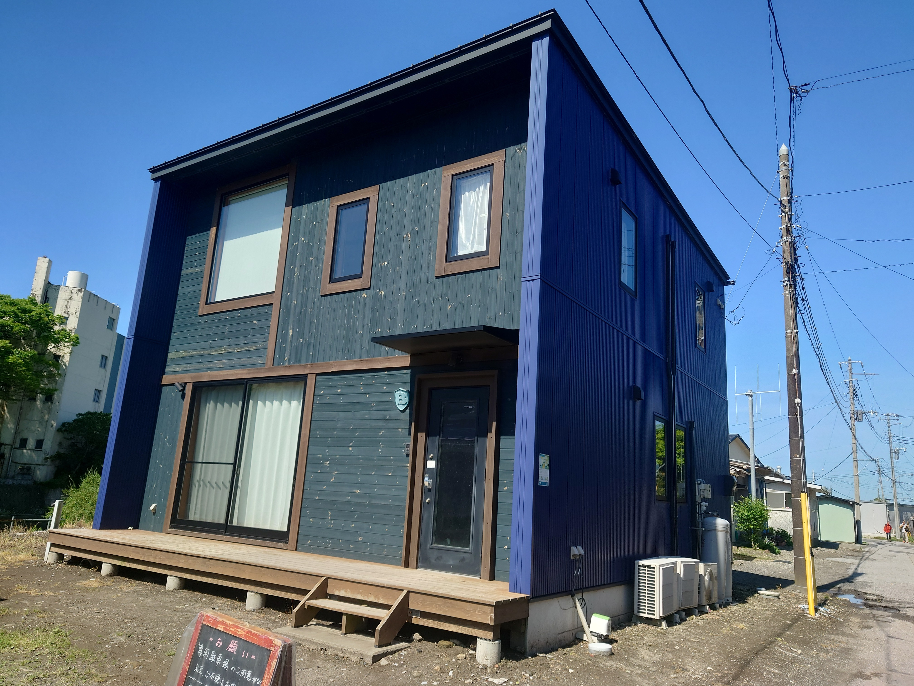
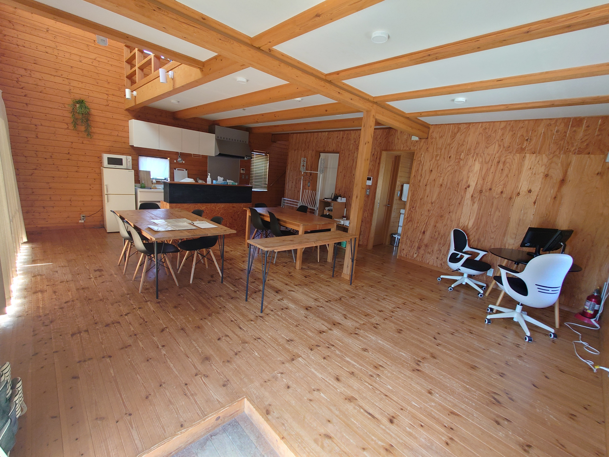
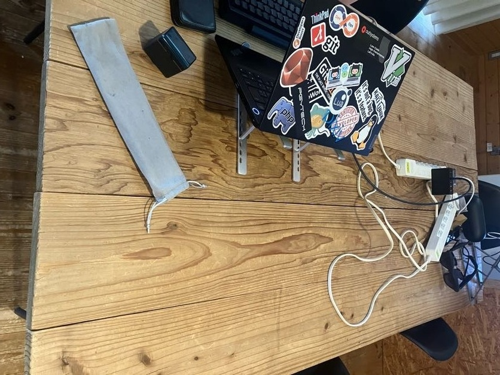
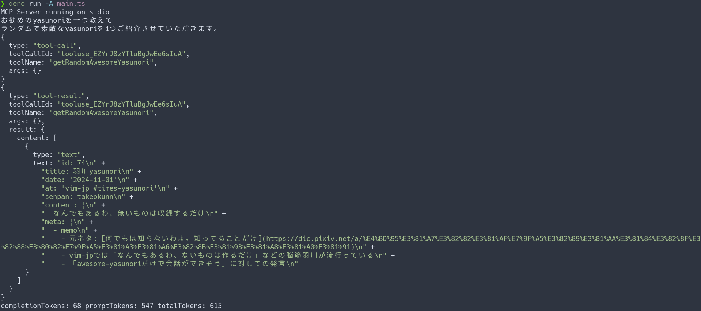

## vim-jp合宿とは？

[thinca]さんが企画してくださって、
2025年5月3日から5月6日の4日間、[vim-jp]のslackでアクティブに活動している自分を含めて8名の方々と合宿に行ってきました。

以下敬称略。

- [thinca]
- [omochice]
- [peacock]
- [kuuote]
- [NI57721]
- [rbtnn]
- [hakkadaikon]
- [yasunori0418]

全員で集まって何かを作るというよりも、各々で好きな開発をするという物です。
当然ながら全員Vimを使っているので、常にVim情報に溢れた環境で、最高のVim活でした。

### どんな場所？

千葉県の南房総にある合宿施設をお借りして合宿をしました。

[voido公式ページ][voido]




## 何をしたか

合宿の中では、普段の日常生活の一環でもあるdotfilesメンテナンスから、合宿らしくバーベキューをしたり、普段できないような開発をしました。



### AIコーディング環境を整えたい

昨今のAIコーディングの波は仕事をしているとcursorという形で身近に感じている物です。\
せっかくのvim合宿ですので、vimに関連することとしてAIコーディングのプラグインを作ろうとしました。

結論から言うと、プラグインはできませんでした。それどころか、本筋ではないMCPクライアントを作り出していました。

MCPについては[こちら](https://modelcontextprotocol.io/introduction)をご覧ください。

MCPクライアントを作る切っ掛けとしては、\
すでに開発されている[openai/codex]や[block/goose]を[vim-denops/denops.vim]を介して操作できるようにしようとしていました。
が、この作戦ではすべての出力結果をうまく取得や操作するのが難しく断念しました。

違う作戦として、コマンド経由で使いづらいなら「使いやすい形で出力してくれるバックグラウンドで動いてくれるMCPクライアントがあったら良いのでは？」と思い、
勢いでMCPクライアントを作り出しました。

### denoでMCPクライアント作り

こちらも結論を先に言うと、このMCPクライアント自体は思うような物にするのは非常に労力が必要です。\
もっと言えば、複数のMCPサーバを扱う方法は各AIエージェントに委ねられている状態です。

以下は[ryoppippi]が作成したジョークMCPサーバの[yasunori-mcp](https://github.com/times-yasunori/awesome-yasunori/tree/main/packages/mcp)という物を使って、
MCPクライアントをdenoで動かせるようにしたサンプルコードです。



```typescript
import { createOpenRouter, LanguageModelV1 } from "@openrouter/ai-sdk-provider";
import {
  CoreMessage,
  experimental_createMCPClient as createMCPClient,
  generateText,
} from "ai";
import { Experimental_StdioMCPTransport as StdioMCPTransport } from "ai/mcp-stdio";

const provider = createOpenRouter({
  apiKey: Deno.env.get("OPENROUTER_API_KEY"),
  extraBody: {
    reasoning: {
      max_tokens: 10,
    },
  },
});

const transport = new StdioMCPTransport({
  command: "npx",
  args: ["-y", "https://pkg.pr.new/times-yasunori/awesome-yasunori/mcp@186"],
});

const query = async (
  model: LanguageModelV1,
  transport: StdioMCPTransport,
  content: string,
) => {
  const client = await createMCPClient({
    name: "mcp-client",
    transport,
  });
  const tools = await client.tools();

  console.log(content);
  const messages: CoreMessage[] = [
    {
      role: "user",
      content,
    },
  ];

  const result = await generateText({
    model,
    messages,
    tools,
    onStepFinish: async () => await client.close(),
  });
  console.log(result.text);
  result.toolCalls.forEach((it) => {
    console.log(it);
  });
  result.toolResults.forEach((it) => {
    console.log(it);
  });

  const { completionTokens, promptTokens, totalTokens } = result.usage;
  console.log(
    `completionTokens: ${completionTokens}`,
    `promptTokens: ${promptTokens}`,
    `totalTokens: ${totalTokens}`,
  );
};

query(
  provider("anthropic/claude-3.5-sonnet"),
  transport,
  "お勧めのyasunoriを一つ教えて",
  // "vimについて教えて",
);
```



接続先のLLMのプロバイダとして、今回は[OpenRouter](https://openrouter.ai/)を利用しました。\
当初の目的では、OpenRouter以外も使えるようにしたかったのですが、まずはお試しの実装ということでOpenRouterのみにしています。

動かせるようになってからいろいろ整理するべきだと思ったので、設定したyasunori-mcpが動かすのをゴールにして、このコード自体は実際に動かすことはできました。



*…yasunoriってなんなんだよ*

ところで、このコード見ていて気になりませんか？\
***…このMCPクライアントって1つのMCPサーバしか登録できなさそうじゃないですか？***

比較的有名なMCPクライアントの代表例としてClaude Desktopでは、次のように設定できます。

```json
{
  "mcpServers": {
    "awesome-yasunori": {
      "command": "npx",
      "args": [
        "-y",
        "https://pkg.pr.new/times-yasunori/awesome-yasunori/mcp@180"
      ]
    },
    "filesystem": {
      "command": "npx",
      "args": [
        "-y",
        "@modelcontextprotocol/server-filesystem",
        "~/src"
      ]
    }
  }
}
```

このjsonを見る限り、`awesome-yasurnori`というMCPと`filesystem`というMCPが2つ存在しますが、先程の実装を思い出してみましょう。

```typescript
const transport = new StdioMCPTransport({
  command: "npx",
  args: ["-y", "https://pkg.pr.new/times-yasunori/awesome-yasunori/mcp@186"],
});

const query = async (
  model: LanguageModelV1,
  transport: StdioMCPTransport,
  content: string,
) => {
  const client = await createMCPClient({
    name: "mcp-client",
    transport,
  });
  const tools = await client.tools();

  console.log(content);
  const messages: CoreMessage[] = [
    {
      role: "user",
      content,
    },
  ];

  const result = await generateText({
    model,
    messages,
    tools,
    onStepFinish: async () => await client.close(),
  });
  // 中略
};
```

`transport`という変数に使用する`yasunori-mcp`サーバを指定していますが、ここには1つのMCPサーバしか指定できません。\
では、先程のClaude Desktopのように複数のMCPサーバを設定しておいて、入力されたプロンプトに応じて適したMCPサーバが使用されるようにするためにはどうするべきでしょうか？

…そう、設定されているMCPサーバの一覧とユーザーからのプロンプトで一度LLMに問い合わせて、適したMCPサーバを選んでもらった後に、
再度選ばれたMCPサーバと初回のユーザープロンプトでLLMに問い合わせが必要になります。

これは人によっては感想が異なる可能性はありますが、私は複数のMCPサーバを良い感じに選択されるように設計されているプロトコルだと思っていました。\
純粋にClaude Desktopでの体験が先にあったので、複数のMCPサーバがある状態でLLMによって自動選択される物だと思っていました。\
複数のMCPサーバを設定できるMCPクライアントがいくつかあり、それらのクライアントを使用するとき、いったいどのように複数のMCPサーバを選択しているのかは、
各MCPクライアントの実装にゆだねられる訳です。

ここで私の考察が正しければ、複数のMCPサーバを設定できるクライアントはどのMCPサーバを使うかを裏で確認されている状態です。\
逆にほかの1MCPサーバのみを設定できる、もしくは実行前にマニュアルで選択するクライアントでは、前述したクライアントとは使用するトークン数が変わってきます。\
もっと言えば、このMCPサーバの選択部分って、規格(プロトコル化)されてなくて大丈夫な物なんでしょうか？

少なくとも私はその部分の実装は面倒だし、クライアント毎に差が生まれるので、プロトコルに含まれてほしいと思いました。

あとは私の拙い解説よりも丁寧にMCPについて解説している記事のリンクを共有しておきます。\
これらを読んでみてから、公式ドキュメントを読んでみると、私のような過ちや勘違いは発生しないはずです。

- [「MCP？聞いたことあるけど使ってない…😅」人向けに初歩から少し踏み込んだ内容まで解説](https://zenn.dev/yamada_quantum/articles/465c4993465053)
- [Function calling の延長線上で MCP を考察](https://qiita.com/7shi/items/e27866ce51c6b9a0f605)

#### 余談と蛇足

追加の事実として、今回作ったMCPクライアントは「ユーザーのプロンプトに限らず、`yasunori-mcp`を自動的に使用するクライアントになってしまった」ということです。\
どんなプロンプトを渡そうが、必ず`yasunori-mcp`が呼び出され、すべての回答に`yasunori`というコンテキストが混入する、
非常に使いづらすぎるMCPクライアントが生まれてしまいました。

あとはMCPに限らず、プロトコルってすごく難しいんだなって、思いました。(まる)

### この記事

さて、`yasunori-mcp`についてはいったん置いておいて、こういった合宿といったイベントはちゃんとブログにしてまとめるべきです。\
先日の入社エントリなどでこの個人ブログのコンテンツは徐々に増えているので、最終日にこの記事を書いています。

解散前に全員で寄った寿司屋の写真も共有しておきます。


寿司屋でPCを開いているのがバレバレですね。\
ちょうど寿司屋でPCを開いているときは、MCPへの思いを書いていたところです。

## まとめ

ライブ感がある内容は準備が必要ですので、今回は以前の[博多に行ってきた](../travel-to-hakata)ような感じよりも、合宿中にできたことへフォーカスした内容にしてみました。\
まぁ、書けば書く程MCPへの思いが強くなりましたが、現在フェリーに乗りながらちゃんとこの記事を書き上げようと執筆している訳です。

きっとほかの方もブログを書いていると思うので、そちらの内容もご覧いただければ、さらに楽しめるかと思います。

最後に合宿の企画をしてくださった、[thinca]さんとそのほかの参加者の方々や合宿の場所を提供してくださった[voido]さんにはあらためて感謝を！

最高の合宿でした！

<!-- links -->
[vim-jp]: https://vim-jp.org
[voido]: https://voido.space/
[vim-denops/denops.vim]: https://github.com/vim-denops/denops.vim
[openai/codex]: https://github.com/openai/codex
[block/goose]: https://github.com/block/goose

<!-- member links -->

[hakkadaikon]: https://github.com/hakkadaikon
[kuuote]: https://github.com/kuuote
[NI57721]: https://github.com/NI57721
[omochice]: https://github.com/omochice
[peacock]: https://github.com/peacock0803sz
[rbtnn]: https://github.com/rbtnn
[thinca]: https://github.com/thinca
[yasunori0418]: https://github.com/yasunori0418

[ryoppippi]: https://github.com/ryoppippi
