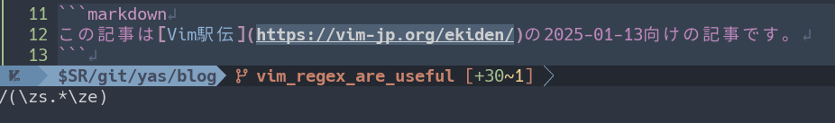

## 始めに



この記事は[Vim駅伝](https://vim-jp.org/ekiden/)の2025-01-13向けの記事です。



業務でデータを加工するときに、「Vimの正規表現を覚えておいて良かったなぁ」と思ったので使い方をメモしておこうと思います。

## `/\zs`と`/\ze`

[vim-jp radio#15](https://audee.jp/voice/show/91959)で触れていたVimの正規表現の機能で`/\zs`と`/\ze`がとっても便利です。

vimのhelpは次のとおり。

- [`:h /\zs`(vimdoc-ja)](https://vim-jp.org/vimdoc-ja/pattern.html#/%5Czs)
- [`:h /\ze`(vimdoc-ja)](https://vim-jp.org/vimdoc-ja/pattern.html#/%5Cze)

上記のヘルプを最初に見たときは何を言っているのか分からず、良さを実感することがありませんでした。\
しかし、このパターンが生きてくるのは、置き換えの`s`コマンドや`gn`テキストオブジェクトと組み合わせたときです。

## UseCase

たとえば、次のような文章を例にします。



```markdown
この記事は[Vim駅伝](https://vim-jp.org/ekiden/)の2025-01-13向けの記事です。
```



ここから丸括弧の中だけを取得するという正規表現で`/\zs`と`/\ze`を使ってみます。

```vim
/(\zs.*\ze)
```



こういう感じの「文字列の中で何かに続いている何かを取り除きたい」ときに便利です。\
今回の場合は、丸括弧の中はマッチしたいけど、丸括弧は残したいというユースケースになりますね。

仮に頑張ってURL部分だけをマッチするような正規表現を書いたとして、「置き換えをしたいのは括弧の中に記述されている物だけ」というパターンで生きてきそうです。\
似たようなパターンでは、特定のHTMLタグに囲まれている中の文字列だけにマッチしたいなどもありそうです。

### 私の場合

次のようなJSONがあったときに、`start_time`と`end_time`の時間と分を分割したいという状況が発生しました。

```json
{
  "id": 1,
  "description": "正常ケース: 営業時間内の予約",
  "date": "2025-01-04",
  "time": "14:00",
  "start_time": "10:00",
  "end_time": "18:00",
  "expected": true
}
```

次のように変換したい。

```json
{
  "id": 1,
  "description": "正常ケース: 営業時間内の予約",
  "date": "2025-01-04",
  "time": "14:00",
  "start_time": { "hours": 10, "minutes": 00 },
  "end_time": { "hours": 18, "minutes": 00 },
  "expected": true
}
```

そして、私は次のようなコマンドで置き換えをしました。

```vim
:%s/\v_time.*\zs"(\d{2}):(\d{2})"\ze/{ "hours": \1, "minutes": \2 }
```

<!-- textlint-disable -->

<!-- textlint-enable -->

凄い！\
雑に正規表現でマッチさせた後に、`/\zs`と`/\ze`で対象を絞って置き換えができる！



こういうテキストエディタの機能を使って、スマートに問題解決できると快感と共に脳汁が出ますよね。\
実際私は、テキストエディタを使いこなしているという感覚に酔いしれることができました。

## まとめと補足

今回一番伝えたいのは、 **「雑に正規表現でマッチさせた後に、`/\zs`と`/\ze`で対象を絞って置き換えができる！」** ということです。

当時の状況を再現するようなデータが用意できなかったので、今回のサンプルデータでは対象を範囲選択したあとに次のコマンドでも問題なく置き換えができます。

```vim
:'<,'>s/\v"(\d{2}):(\d{2})"/{"hours": \1, "minutes": \2}
```

*「もしかしたらあのとき、`/\zs`と`/\ze`を使わなくても、この正規表現で簡単に置き換えできたかもしれねぇ…。」*

ただ、あのときはこのコマンドをマクロの中で実行したかったので、\
バッファー全体（`%`）に対する置き換えという状況なら何も問題ありません。

## 参考文献

- [`:h /\zs`(vimdoc-ja)](https://vim-jp.org/vimdoc-ja/pattern.html#/%5Czs)
- [`:h /\ze`(vimdoc-ja)](https://vim-jp.org/vimdoc-ja/pattern.html#/%5Cze)
- 類似するパターンとして、[Perl正規表現の`\K`の説明](https://perldoc.jp/docs/perl/5.40.0/perlre.pod#:~:text=(%3F%3C%3Dpattern)-,%5CK,-(*plb%3Apattern))
