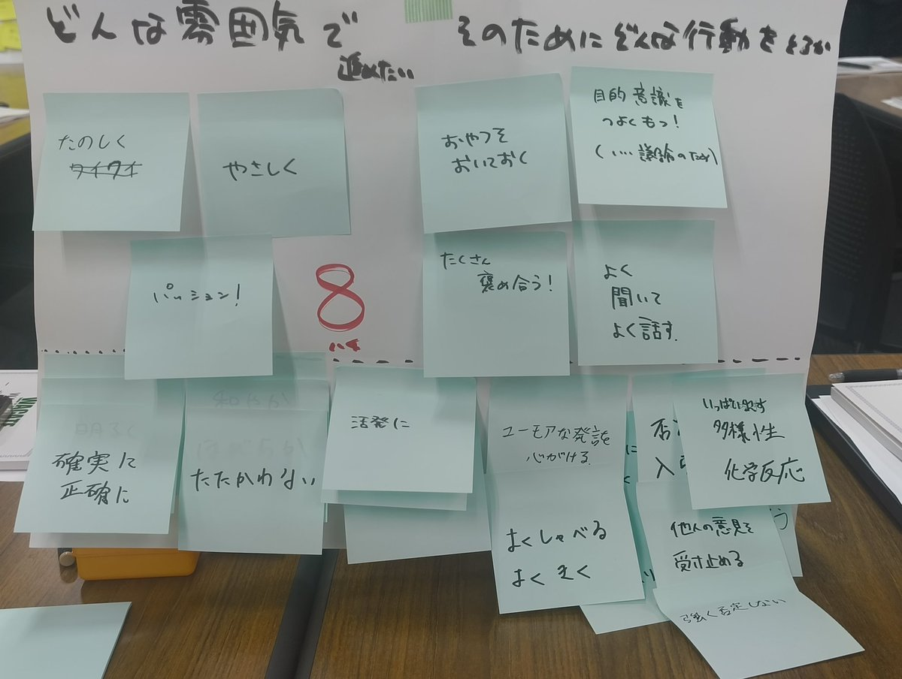

## 始めに

[WACATE2025 夏〜動かすだけじゃだめですか？〜][wacate]

## 1日目

### ポジペを使いながらの自己紹介とチームガイドライン作成ワーク

### BPPセッション: 新卒でQAになった人のLT

前回の2024冬のWACATE参加者で、他の参加者から参加時のポジションペーパーが良かったと投票してもらうと、次のWACATEに無料で招待されます。
今回登壇

<!-- textlint-disable -->


- どんな人
  - QA歴9ヵ月
  - 自分の付加価値のためにプログラムを学んでいた人
  - 内定した人からインターンの紹介をもらって、会社のインターンに参加しそのまま就職
- QAになってから最初
  - 開発とQAが敵対している関係になっていた
  - 不具合を見つけていくと、開発の人と仲が悪くなると思ってしまっていた
- 相談後
  - QAはバグを出さないこと(バグゼロ)にするのが目標ではないことに気がつく
  - 開発チームから感謝されるやりとりがあって、考え方が変わっていく
- リリース後の打ち上げ飲み会の席で、感謝の言葉をもらう
- 仕事をしていく中で顧客に対する価値提供であることに気がつく
- QAとしての考え方
  - 品質について考えるプロになる
    - 開発の人は開発のプロであるため
    - 開発者から信頼されるため
  - 開発の人とのチームビルディングのために
    - slackのリアクションを複数付ける
    - ファシリを積極的に実施している
- QAの魅力
  - 製品に詳しくなれる
  - 不具合の報告と、改善されたことによる感謝の言葉が楽しい



<!-- textlint-enable -->

### セッション1: テストプロセスについて

スライドについては[こちら][session1]。

セッション全体はとしては、何かワークを実施するとかではなく、スピーカセッシオンの内容を聞く座学がメインでした。
この後のワークのための事前座学的な内容ではあるが、普段の開発の一環としてのテストというよりもテストを実施していく上で必要なプロセスについての解説。

ISTQBのシラバスに示されている内容をベースにした内容ではあるが、実際の開発現場で起こりうる可能性についての話もありました。
詳しくはスライドを見てもらえると、テストについて形式的な知識を得られると思います。

このセッションを聞いて思っていたのは、ログラスは開発の各フェーズでテストするという開発フローになっていると同時に、テストのことも常に考える文化が醸成されている。
シラバスによって定義されている各テストプロセスを形式的にインプットしながら、文化や環境を構築できていることの偉大さを再認識することになりました。

## 1～2日間: テストプロセスワーク

## 2日目

### 招待講演

当日のスライドや資料に関しては、参加者限定で公開されていて、ここで共有は難しいが当日に聞きながら思ったことを書きだしておきます。

- **テスコンのテスト設計プロセスができるまで**
  - 今回学んだテストプロセス自体、最初はなかった
  - 最初はテストアーキテクチャと呼ばれていた
  - そもそも、テストプロセスが最初には存在しなかったことに驚きだった
  - そして、日本発祥というのが誇りに感じました
  - てっきり、ISTQBで定義されているものだと思っていた
  - https://jasst.jp/archives/jasst09e.html#closing
- **バグのにおい**
  - 仕様書を見ながら、不自然な何かを感じとり、バグをみつける
    - まるで警察官の勘で犯人が見つかるみたいな雰囲気を感じる
  - コードスメルという研究用語がある
    - ソースコードコメントに着目した不確かさとソフトウェア品質の関係性調査
    - https://jasst.jp/symposium/jasstreview19/report.html
  - 講演している人は組込み系のテストをやっているため、実際のコードでにおうということがあったらしい
- **ISO 9000認証取得が日本に入ってきた時の話**
  - 国家間の製品やサービスの好感を助けて標準化活動
  - 日本のソフトウェア業界に入ってきたのは1990年後半ころ
  - 海外や官公庁の案件で必要になると話題になっていた
  - このころから業界内で、一人QAという言葉が生まれていた
  - 「やるべきことをやっていれば、たいへんではない」らしい
    - この当たり前が一番たいへんだと思いながら話を聞いていた
- **JSTQBシラバス翻訳裏話**
  - 標準に対する翻訳のため、解釈や翻訳を間違えることによって、間違った標準になってしまうというプレッシャーがあったらしい
  - 表現的にカタカナにするか日本語に和訳するか、海外側の表現と合わせることの悩み
  - テストレベルという言葉は当時日本には存在しない用語だった
    - 他にも、テストベース、インシデント、テストアイテムも存在しなかった
  - 今も海外の資料を翻訳している人曰く、「今はAI時代だからね～」ということらしい
    - 最強の翻訳のためのプロンプトが存在する(非公開)
- **レビューはテストに入りますか？問題**
  - レビューは一般的には **静的テスト** に該当する
  - テストに関する標準によってはレビューはテスト技法になっていない
    - `ISO29119/IEC/IEEE`では、テスト技法ではない
  - TDDはテストではなく設計技法である
  - 最近では静的解析によるテスト(linter)が存在するため、これもある種のテストと言える
- 質問コーナー(気になった物だけ)
  - AIの振る舞いに対するテストはQA4AIというコンソーシアムがある
    - https://www.qa4ai.jp/

## 最後に

<!-- links -->
[wacate]: https://wacate.jp/workshops/2025summer/
[session1]: https://speakerdeck.com/kiyou77/test-process
